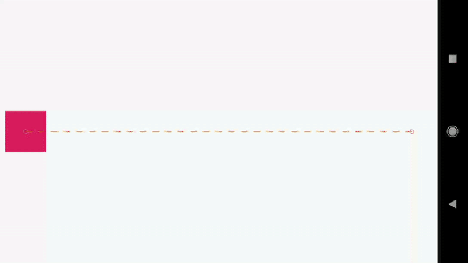
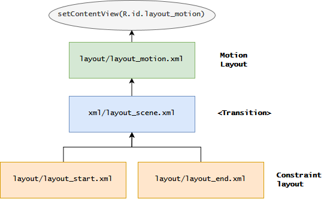
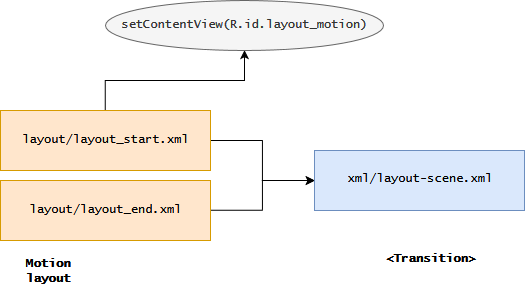
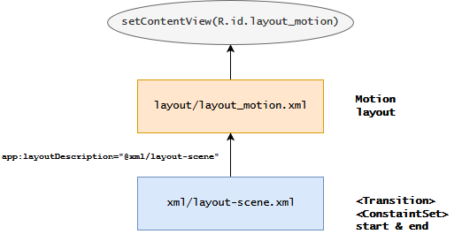

# Motion layout 

[[toc]]

---

* [Intorduction to MotionLayout](https://medium.com/google-developers/introduction-to-motionlayout-part-i-29208674b10d)
* [Tutorial](https://www.slideshare.net/BrittBarakHIRING/make-your-app-dance-with-motionlayout)
* [Tutorial - making slideshow](https://www.raywenderlich.com/8883-motionlayout-tutorial-for-android-getting-started)
* [Motion Examples](https://github.com/mtcn/MotionLayoutExamples)
* [Dev101](https://balusangem.github.io/motionlayoutintro/#0)
* [Manage animation in code](https://www.androidauthority.com/motionlayout-animations-android-apps-896717/)

### Intro 
**MotionLayout** - Позволяет анимириовать переход из одного состояния в другое.


<br><br>

`MotionLayout`, как следует из его названия, это, прежде всего, макет, позволяющий вам позиционировать свои элементы. Это на самом деле подкласс `ConstraintLayout` и основывается на его богатых возможностях макета.

**Главная идея** - создаем 2 макета - начальное и конечное состояние экрана. И связываем их с MotionLayout. Это и позволит анимировать переход с одного состояние в другое.

`MotionLayout` был создан для преодоления разрыва между переходами макета и сложной обработкой движения. Вы можете рассматривать это с точки зрения возможностей как смесь между инфраструктурой анимации свойств, TransitionManager и CoordinatorLayout.

### Подходы для создания анимации
**1.** Создание 2 макетов(начальное и конечное состояние), сцены(описание анимации) и макета-motion


:::tip
Этот подход позволяет видеть начальное и конечное состояние 
:::
<br><br>

**2.** Создание 2 макетов-motion(начальное и конечное состояние) и сцены(описание анимации)


:::tip
Этот подход позволяет видеть начальное и конечное состояние и сократить кол-во файлов для создания анимации
:::
<br><br>

**3.** **RECOMMEND** - Создание макета и сцены, а в сцене описать начальное и конечное состояние


:::tip
Этот подход сократить кол-во файлов для создания анимации до 2-х: сцены и motion-разметки
:::
<br>

### Сцена (описание анимации)
Ключевые теги: 
* `<Transition>` - описывает на какое действие запускать анимацию (`<OnClick>` & `<OnSwipe>`), а также `<KeyFrameSet>`
* `<ConstraintSet>` - описывает начальное и конечное состояние  


### Сцена: пример
xml/layout_scene.xml
```xml
<?xml version="1.0" encoding="utf-8"?>
<MotionScene xmlns:android="http://schemas.android.com/apk/res/android"
             xmlns:motion="http://schemas.android.com/apk/res-auto">

             
    <!-- ВАЖНО:
      Использовать не android:layout_constraint...,
                    а motion:layout_constraint...
    -->

    <!-- указываем начальное и конечное состояние, длительность, интерполятор -->
    <Transition
            motion:constraintSetStart="@+id/start"
            motion:constraintSetEnd="@+id/end"
            motion:duration="1000">

        <!-- Анимация активируеться при движении элемента вправо --> 
        <OnSwipe
            motion:touchAnchorId="@+id/button"
            motion:touchAnchorSide="right"
            motion:dragDirection="dragRight" />

        <!-- Позволяет делать изменение во время анимации -->
        <KeyFrameSet>
            <!-- увеличивает размер обьекта -->
            <KeyAttribute
                android:scaleX="2"
                android:scaleY="2"
                android:rotation="-45"
                motion:framePosition="50"
                motion:target="@id/button" />

            <!-- изменяеть траекторию обьекта, без этого движеться по прямой -->
            <KeyPosition
                motion:keyPositionType="parentRelative"
                motion:percentY="0.2"
                motion:framePosition="20"
                motion:target="@id/button"/>

        </KeyFrameSet>
    </Transition>

    <!--
     Если убирать в Constraint неизменяемые свойтсва то они будут сбрасываться в ноль
     Например: Я хочу изменить высоту Toolbar, но я думаю что в конечном состоянии можно же убрать ширину, так как я её не меняю верно?
     но, если её не указать ширина сброситься в ноль, по-этому в начальном и конечном состоянии надо указывать все аттрибуты элементов
    -->

    <!-- Начальное состояние -->
    <ConstraintSet android:id="@+id/start">
        <Constraint
                android:id="@+id/button"
                android:layout_width="64dp"
                android:layout_height="64dp"
                android:layout_marginStart="8dp"
                motion:layout_constraintBottom_toBottomOf="parent"
                motion:layout_constraintStart_toStartOf="parent"
                motion:layout_constraintTop_toTopOf="parent" />
    </ConstraintSet>

    <!-- Конечное состояние -->
    <ConstraintSet android:id="@+id/end">
        <Constraint
                android:id="@+id/button"
                android:layout_width="64dp"
                android:layout_height="64dp"
                android:layout_marginEnd="8dp"
                motion:layout_constraintBottom_toBottomOf="parent"
                motion:layout_constraintEnd_toEndOf="parent"
                motion:layout_constraintTop_toTopOf="parent" />
    </ConstraintSet>

</MotionScene>
```

:::tip ВАЖНО
Использовать не `android:layout_constraint...`, а `motion:layout_constraint...`
:::

layout/layout_motion.xml
```xml
<?xml version="1.0" encoding="utf-8"?>
<android.support.constraint.motion.MotionLayout
        xmlns:android="http://schemas.android.com/apk/res/android"
        xmlns:tools="http://schemas.android.com/tools"
        xmlns:app="http://schemas.android.com/apk/res-auto"
        android:id="@+id/motionLayout"
        app:layoutDescription="@xml/scene_02"
        android:layout_width="match_parent"
        android:layout_height="match_parent">

    <View
            android:id="@+id/button"
            android:background="@color/colorAccent"
            android:layout_width="64dp"
            android:layout_height="64dp"
            android:text="Button" tools:layout_editor_absoluteX="339dp"
            tools:layout_editor_absoluteY="334dp"/>

</android.support.constraint.motion.MotionLayout>
```

```Kotlin
class MainActivity : AppCompatActivity() {
  override fun onCreate(savedInstanceState: Bundle?) {
    super.onCreate(savedInstanceState)
    setContentView(R.layout.layout_motion)
  }
}
```